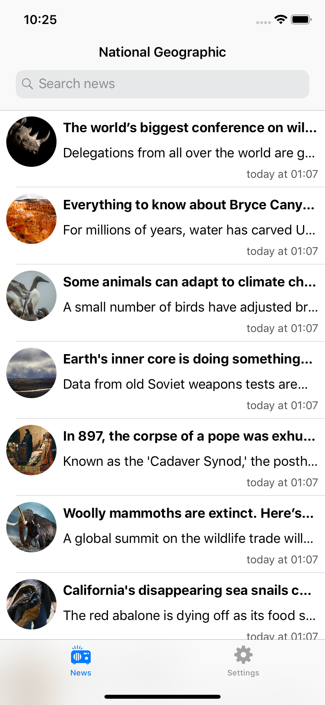
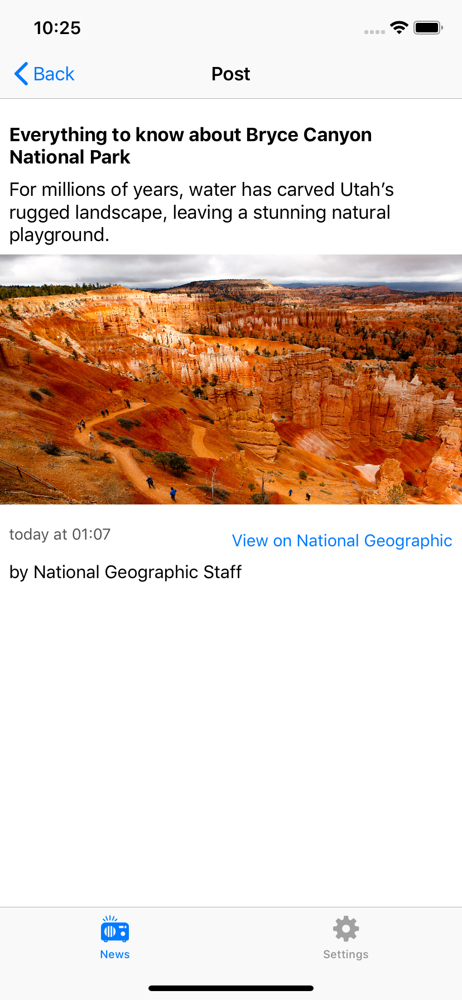
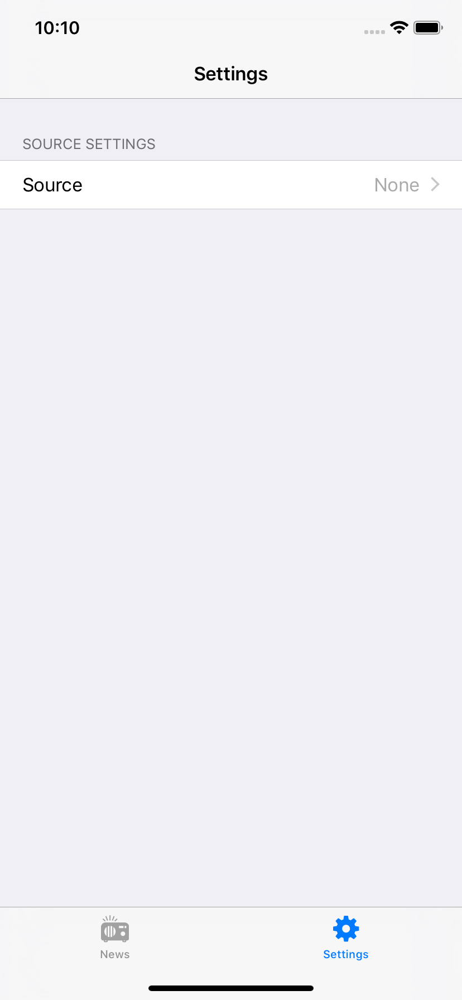
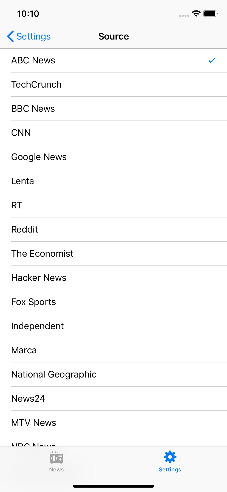

# Swift RSS Aggregator

A simple news aggregator from the different news sources!

## Easy to use
A pretty nice interface helps you to read fresh news without any annoying. Explore the events from different points of view to get maximum of objective information.

## Many news sources
News reading have never been so comfortable. RSS Aggregator supports 18 news sources!

## Preview

   
   
    
   

# Requirements

* Swift 4+
* iOS 12+

# Author

BardRedStar, den.kovalev999@gmail.com
